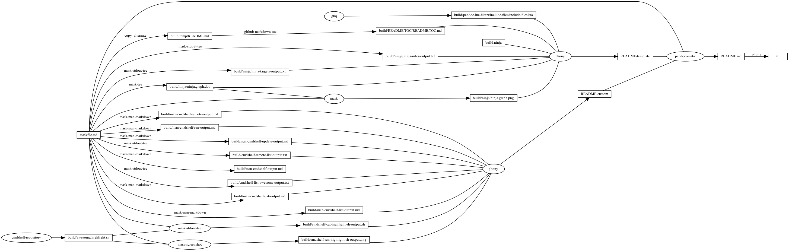

# cmdshelf

<!-- markdownlint-disable MD007 MD030 -->

-   [cmdshelf](#cmdshelf)
-   [Mask SubCommands](#mask-subcommands)
    -   [cmdshelf-remote-add](#cmdshelf-remote-add)
    -   [cmdshelf-remote-list](#cmdshelf-remote-list)
        -   [cmdshelf-remote-list-output](#cmdshelf-remote-list-output)
    -   [cmdshelf-update](#cmdshelf-update)
    -   [cmdshelf-list-awesome](#cmdshelf-list-awesome)
        -   [cmdshelf-list-awesome-output](#cmdshelf-list-awesome-output)
    -   [cmdshelf-cat-highlight-sh](#cmdshelf-cat-highlight-sh)
        -   [cmdshelf-cat-highlight-sh-output](#cmdshelf-cat-highlight-sh-output)
    -   [cmdshelf-run-highlight-sh](#cmdshelf-run-highlight-sh)
    -   [unlink-cmdshelf-repository](#unlink-cmdshelf-repository)
    -   [man-cmdshelf](#man-cmdshelf)
        -   [man-cmdshelf-output](#man-cmdshelf-output)
    -   [man-cmdshelf-cat](#man-cmdshelf-cat)
        -   [man-cmdshelf-cat-output](#man-cmdshelf-cat-output)
    -   [man-cmdshelf-list](#man-cmdshelf-list)
        -   [man-cmdshelf-list-output](#man-cmdshelf-list-output)
    -   [man-cmdshelf-remote](#man-cmdshelf-remote)
        -   [man-cmdshelf-remote-output](#man-cmdshelf-remote-output)
    -   [man-cmdshelf-run](#man-cmdshelf-run)
        -   [man-cmdshelf-run-output](#man-cmdshelf-run-output)
    -   [man-cmdshelf-update](#man-cmdshelf-update)
        -   [man-cmdshelf-update-output](#man-cmdshelf-update-output)
    -   [begin: mask task in template : build
        content](#begin-mask-task-in-template--build-content)
    -   [ninja-rules](#ninja-rules)
        -   [ninja custom-rule](#ninja-custom-rule)
        -   [ninja-rules-output](#ninja-rules-output)
    -   [ninja-targets](#ninja-targets)
        -   [ninja build-all](#ninja-build-all)
        -   [ninja custom-build](#ninja-custom-build)
        -   [ninja report-build](#ninja-report-build)
        -   [ninja-targets-output](#ninja-targets-output)
    -   [readme-md](#readme-md)
        -   [ninja readme-build](#ninja-readme-build)
    -   [end: mask task in template : build
        content](#end-mask-task-in-template--build-content)
    -   [begin: mask task in template : ninja
        command](#begin-mask-task-in-template--ninja-command)
    -   [ninja-browse](#ninja-browse)
    -   [ninja-graph-png](#ninja-graph-png)
    -   [ninja-graph-dot-xdot](#ninja-graph-dot-xdot)
    -   [ninja-graph-dot](#ninja-graph-dot)
        -   [ninja-graph-dot-output](#ninja-graph-dot-output)
    -   [ninja-all](#ninja-all)
        -   [build.ninja](#buildninja)
    -   [end: mask task in template : ninja
        command](#end-mask-task-in-template--ninja-command)

<!-- markdownlint-enable MD007 MD030 -->

# Mask SubCommands

[Mask Awesome](https://github.com/huzhenghui/mask-awesome)

## cmdshelf-remote-add

``` bash
cmdshelf remote add awesome git@github.com:huzhenghui/cmdshelf-awesome.git
```

## cmdshelf-remote-list

``` bash
cmdshelf remote list | ack '^awesome:'
```

### cmdshelf-remote-list-output

``` plain
awesome:git@github.com:huzhenghui/cmdshelf-awesome.git
```

## cmdshelf-update

``` bash
cmdshelf update
```

## cmdshelf-list-awesome

``` bash
mask unlink-cmdshelf-repository
cmdshelf list | ack '^awesome:'
```

### cmdshelf-list-awesome-output

``` plain
awesome:highlight-copy.sh
awesome:cmdshelf/build/pandoc-lua-filters/runtests.sh
awesome:cmdshelf/build/pandoc-lua-filters/minted/background_color.py
awesome:cmdshelf/build/pandoc-lua-filters/minted/run_minted_tests.py
awesome:highlight.sh
awesome:highlight-browser.sh
```

## cmdshelf-cat-highlight-sh

``` bash
cmdshelf cat highlight.sh
```

### cmdshelf-cat-highlight-sh-output

<!-- markdownlint-disable MD013 -->

``` bash
#!/bin/sh
SCRIPTPATH="$(realpath "${BASH_SOURCE[0]}")"
if [[ "${#}" == 1 ]]; then
    if [[ -s "${1}" ]]; then
        TARGETFILE="${1}"
    else
        TARGETFILE="${SCRIPTPATH}"
    fi
else
    TARGETFILE="${SCRIPTPATH}"
fi
highlight --style="$( \
        fd --base-directory=/usr/local/opt/highlight/share/highlight/themes --exec echo "{.}" | \
        sort --random-sort | \
        head -n 1 \
    )" --line-number --replace-tabs=2 "${TARGETFILE}"
```

<!-- markdownlint-enable MD013 -->

## cmdshelf-run-highlight-sh

``` bash
cmdshelf run highlight.sh "${MASKFILE_DIR}/maskfile.md"
```


## unlink-cmdshelf-repository

``` bash
stub_path="${MASKFILE_DIR}/build/awesome"
echo "${stub_path}" 1>&2
if [[ -L "${stub_path}" ]]; then
    unlink "${stub_path}"
fi
```

## man-cmdshelf

``` bash
man cmdshelf
```

### man-cmdshelf-output

<!-- markdownlint-disable MD012 MD013 -->
<!-- vale off -->

CMDSHELF(1)                     Cmdshelf Manual                    CMDSHELF(1)  
  
  
  
**NAME**  
       **cmdshelf** - Manage your scripts like a bookshelf.  
  
**SYNOPSIS**  
       **cmdshelf** &lt;**sub-command**&gt; **…**  
  
**OPTIONS**  
       -h, –help  
              Show  help  message.  Type **cmdshelf** **help** **sub-command** to see more  
              detailed manual page for each sub-command.  
  
**SUB-COMMANDS**  
   **cat**  
       Concatenate and print command(s).  
  
   **help**  
       Show help message.  
  
   **list,** **ls**  
       Show all registered commands.  
  
   **remote**  
       Manage remote commands.  
  
   **run**  
       Execute command.  
  
   **update**  
       Update cloned repositories.  
  
**WORKSPACE**  
   **\~/.cmdshelf.yml**  
       Your current configuration is stored here.  **cmdshelf**  reads  this  file  
       everytime it launches, writing on exit. Feel free to modify entries and  
       run cmdshelf update to keep in sync.  
  
   **\~/.cmdshelf/remote**  
       All repositories are cloned under this directory.  
  
  
  
cmdshelf 1.0.2                   January 2018                      CMDSHELF(1)  

<!-- vale on -->
<!-- markdownlint-enable MD012 MD013 -->

## man-cmdshelf-cat

``` bash
man cmdshelf-cat
```

### man-cmdshelf-cat-output

<!-- markdownlint-disable MD012 -->

CMDSHELF-CAT(1)                 Cmdshelf Manual                CMDSHELF-CAT(1)  
  
  
  
**NAME**  
       cmdshelf-cat - Concatenate and print command(s).  
  
**SYNOPSIS**  
       **cmdshelf** **cat** \[\[&lt;remoteName&gt;:\]&lt;command&gt;\]  
  
**DESCRIPTION**  
       The  cat  subcommand  reads commands script files sequentially, writing  
       them to the standard output.  
  
  
  
cmdshelf 1.0.2                   February 2018                 CMDSHELF-CAT(1)  

<!-- markdownlint-enable MD012 -->

## man-cmdshelf-list

``` bash
man cmdshelf-list
```

### man-cmdshelf-list-output

<!-- markdownlint-disable MD012 -->

CMDSHELF-LIST(1)                Cmdshelf Manual               CMDSHELF-LIST(1)  
  
  
  
**NAME**  
       cmdshelf-list - Show all registered commands.  
  
**SYNOPSIS**  
       **cmdshelf** **list** \[–path\]  
  
**DESCRIPTION**  
       The list subcommand lists all commands from remotes.  
  
**OPTIONS**  
       –path  
           Print absolute paths for each commands.  
  
  
  
cmdshelf 1.0.2                   January 2018                 CMDSHELF-LIST(1)  

<!-- markdownlint-enable MD012 -->

## man-cmdshelf-remote

``` bash
man cmdshelf-remote
```

### man-cmdshelf-remote-output

<!-- markdownlint-disable MD012 MD013 -->
<!-- vale off -->

CMDSHELF-REMOTE(1)              Cmdshelf Manual             CMDSHELF-REMOTE(1)  
  
  
  
**NAME**  
       cmdshelf-remote - Manage set of tracked repositories  
  
**SYNOPSIS**  
       **cmdshelf** **remote** **add** &lt;name&gt; &lt;url&gt;  
       **cmdshelf** **remote** **list**  
       **cmdshelf** **remote** **remove** &lt;name&gt;  
  
  
**DESCRIPTION**  
       Manage the set of repositories ("remotes").  
  
**SUB-COMMANDS**  
   **add**  
       Adds a remote named &lt;name&gt; for the repository at &lt;url&gt;.  
  
   **list,** **ls**  
       List tracked remotes.  
  
   **remove,** **rm**  
       Remove the remote named &lt;name&gt;. This won't remove the local repository.  
       Clean on your own if needed.  
  
  
  
cmdshelf 1.0.2                   February 2018              CMDSHELF-REMOTE(1)  

<!-- vale on -->
<!-- markdownlint-enable MD012 MD013 -->

## man-cmdshelf-run

``` bash
man cmdshelf-run
```

### man-cmdshelf-run-output

<!-- markdownlint-disable MD012 MD013 -->
<!-- vale off -->

CMDSHELF-RUN(1)                 Cmdshelf Manual                CMDSHELF-RUN(1)  
  
  
  
**NAME**  
       cmdshelf-run - Execute command  
  
**SYNOPSIS**  
       **cmdshelf** **run** \[&lt;remoteName&gt;:\]&lt;command&gt; \[&lt;args&gt;\]  
  
**DESCRIPTION**  
       The run subcommand receives command-alias and whitespace separated list  
       of parameters.  
  
**AVOIDING** **NAMESPACE** **CONFLICT**  
       The **run** subcommand picks up first command matches the &lt;command&gt;. If you  
       have same command names from different remotes, add &lt;**remoteName**&gt;:  pre-  
       fix to to be explicit.  
                  e.g. cmdshelf run myRemote:echo-sd hello  
  
  
  
cmdshelf 1.0.2                   February 2018                 CMDSHELF-RUN(1)  

<!-- vale on -->
<!-- markdownlint-enable MD012 MD013 -->

## man-cmdshelf-update

``` bash
man cmdshelf-update
```

### man-cmdshelf-update-output

<!-- markdownlint-disable MD012 -->

CMDSHELF-UPDATE(1)              Cmdshelf Manual             CMDSHELF-UPDATE(1)  
  
  
  
**NAME**  
       cmdshelf-update - Update cloned local repositories.  
  
**SYNOPSIS**  
       **cmdshelf** **update**  
  
**DESCRIPTION**  
       The **update** subcommand updates each cloned repositories.  
  
  
  
cmdshelf 1.0.2                   February 2018              CMDSHELF-UPDATE(1)  

<!-- markdownlint-enable MD012 -->

## begin: mask task in template : build content

## ninja-rules

``` bash
ninja -t rules
```

### ninja custom-rule

``` ninja
rule cmdshelf-repository
  command = $$( $
    cmdshelf remote list | ack "^$cmdshelf_name" 1>&2 || $
    cmdshelf remote add "$cmdshelf_name" "$cmdshelf_url" 1>&2 $
    ) && $
    repository_path="$$(realpath $${HOME}/.cmdshelf/remote/$cmdshelf_name)" && $
    echo "$${repository_path}" && $
    stub_path="$$(realpath ./build/$cmdshelf_name)" && $
    echo "$${stub_path}" && $
    find -d "$${stub_path}" -exec rmdir {} \; && $
    ln -Fs "$${repository_path}" "$${stub_path}"
  generator = 1

```

### ninja-rules-output

``` plain
cmdshelf-repository
copy_alternate
ghq
github-markdown-toc
mask
mask-man-markdown
mask-screenshot
mask-stderr-tee
mask-stdout-csv-markdown
mask-stdout-tee
mask-tee
pandocomatic
phony
```

## ninja-targets

``` bash
ninja -t targets all
```

### ninja build-all

``` ninja
build all: phony README.md

default all

```

### ninja custom-build

``` ninja
# custom build here

```

### ninja report-build

``` ninja
# report build here

```

### ninja-targets-output

``` plain
all: phony
build/pandoc-lua-filters/include-files/include-files.lua: ghq
build/ninja/ninja-rules-output.txt: mask-stdout-tee
build/ninja/ninja-targets-output.txt: mask-stdout-tee
build/ninja/ninja.graph.dot: mask-tee
build/ninja/ninja.graph.png: mask
build/temp/README.md: copy_alternate
build/README.TOC/README.TOC.md: github-markdown-toc
README-template: phony
build/cmdshelf-remote-list-output.txt: mask-stdout-tee
build/cmdshelf-list-awesome-output.txt: mask-stdout-tee
build/awesome/highlight.sh: cmdshelf-repository
build/cmdshelf-cat-highlight-sh-output.sh: mask-stdout-tee
build/cmdshelf-run-highlight-sh-output.png: mask-screenshot
build/man-cmdshelf-output.md: mask-man-markdown
build/man-cmdshelf-cat-output.md: mask-man-markdown
build/man-cmdshelf-list-output.md: mask-man-markdown
build/man-cmdshelf-remote-output.md: mask-man-markdown
build/man-cmdshelf-run-output.md: mask-man-markdown
build/man-cmdshelf-update-output.md: mask-man-markdown
README-custom: phony
README.md: pandocomatic
```

## readme-md

``` bash
ninja --verbose README.md
```

### ninja readme-build

``` ninja
build ./build/cmdshelf-remote-list-output.txt : mask-stdout-tee ./maskfile.md
  mask_subcommand = cmdshelf-remote-list

build ./build/cmdshelf-list-awesome-output.txt : mask-stdout-tee ./maskfile.md
  mask_subcommand = cmdshelf-list-awesome

# ninja will ceate ./build/awesome/ automaticly
build ./build/awesome/highlight.sh : cmdshelf-repository
  cmdshelf_name = awesome
  cmdshelf_url = git@github.com:huzhenghui/cmdshelf-awesome.git

build ./build/cmdshelf-cat-highlight-sh-output.sh : $
  mask-stdout-tee ./maskfile.md | ./build/awesome/highlight.sh
  mask_subcommand = cmdshelf-cat-highlight-sh

build ./build/cmdshelf-run-highlight-sh-output.png : $
  mask-screenshot ./maskfile.md | ./build/awesome/highlight.sh
  mask_subcommand = cmdshelf-run-highlight-sh

build ./build/man-cmdshelf-output.md : mask-man-markdown ./maskfile.md
  mask_subcommand = man-cmdshelf

build ./build/man-cmdshelf-cat-output.md : mask-man-markdown ./maskfile.md
  mask_subcommand = man-cmdshelf-cat

build ./build/man-cmdshelf-list-output.md : mask-man-markdown ./maskfile.md
  mask_subcommand = man-cmdshelf-list

build ./build/man-cmdshelf-remote-output.md : mask-man-markdown ./maskfile.md
  mask_subcommand = man-cmdshelf-remote

build ./build/man-cmdshelf-run-output.md : mask-man-markdown ./maskfile.md
  mask_subcommand = man-cmdshelf-run

build ./build/man-cmdshelf-update-output.md : mask-man-markdown ./maskfile.md
  mask_subcommand = man-cmdshelf-update

build README-custom : phony $
  ./build/cmdshelf-remote-list-output.txt $
  ./build/cmdshelf-list-awesome-output.txt $
  ./build/cmdshelf-cat-highlight-sh-output.sh $
  ./build/cmdshelf-run-highlight-sh-output.png $
  ./build/man-cmdshelf-output.md $
  ./build/man-cmdshelf-cat-output.md $
  ./build/man-cmdshelf-list-output.md $
  ./build/man-cmdshelf-remote-output.md $
  ./build/man-cmdshelf-run-output.md $
  ./build/man-cmdshelf-update-output.md

```

``` ninja
build README.md : pandocomatic maskfile.md | README-template README-custom

```

## end: mask task in template : build content

## begin: mask task in template : ninja command

## ninja-browse

``` bash
ninja -t browse
```

## ninja-graph-png

``` bash
dot -Tpng -o./build/ninja/ninja.graph.png ./build/ninja/ninja.graph.dot
```



## ninja-graph-dot-xdot

``` bash
detach -- xdot "${MASKFILE_DIR}/build/ninja/ninja.graph.dot"
```

## ninja-graph-dot

``` bash
ninja -t graph
```

### ninja-graph-dot-output


## ninja-all

``` bash
ninja --verbose
```

### build.ninja

``` ninja
builddir=./build
mask_subcommand = --help
mask_stdout_csv_markdowndelimiter = ","

#######################################
# begin: rule in template

rule mask
  command = mask --maskfile $in $mask_subcommand

rule mask-tee
  command = mask --maskfile $in $mask_subcommand 2>&1 | tee $out 1> /dev/null

rule mask-stdout-tee
  command = mask --maskfile $in $mask_subcommand 2>/dev/null | tee $out 1> /dev/null

rule mask-stderr-tee
  command = bash -c 'mask $mask_subcommand 1>/dev/null 2> >(tee $out)'

# <!-- markdownlint-disable MD013 -->
rule mask-man-markdown
  command = set -e && set -o pipefail && $
    mask --maskfile $in $mask_subcommand | $
    ul | $
    ansifilter --bbcode | $
    inv --search-root="$$(ghq list --full-path https://github.com/huzhenghui/pyinvoke-awesome)/bbcode" bbcode-parser-format | $
    pandoc --from=html --to=markdown | $
    tee $out 1> /dev/null
# <!-- markdownlint-enable MD013 -->

rule mask-stdout-csv-markdown
  command = mask --maskfile $in $mask_subcommand 2>/dev/null | $
    csvtomd --delimiter "$$(echo $mask_stdout_csv_markdowndelimiter)" | $
    tee $out 1> /dev/null

rule mask-screenshot
  command = $
    regular_logfile="./build/temp/$$(basename $out).mask-screenshot.logfile" && $
    rm -f -v "$${regular_logfile}" && $
    until [[ -s "$${regular_logfile}" ]]; do $
      screen_logfile="$$(mktemp -d)/logfile"; $
      echo "$${screen_logfile}"; $
      mkfifo "$${screen_logfile}"; $
      screen -L -Logfile "$${screen_logfile}" $
        -dmS mask-screenshot-"$$(basename $out)" $
        sh -c "stdbuf -o0 mask --maskfile $in $mask_subcommand; $
          date +'%F %T %Z %z - %+ https://github.com/huzhenghui' | lolcat;"; $
      dd bs=1 if="$${screen_logfile}" of="$${regular_logfile}"; $
    done && $
    ansifilter --html --encoding=utf8 --input="$${regular_logfile}" | $
      tee ./build/temp/"$$(basename $out)".mask-screenshot.html | $
      wkhtmltoimage --format png - "$out"

rule pandocomatic
  command = pandocomatic --input $in --output $out

rule ghq
  command = ghq get --update "$repository" && $
    find -d "$link_dirname" -exec rmdir {} \; && $
    ln -Fs "$$(ghq list --full-path $repository)" "$link_dirname"
  generator = 1

rule github-markdown-toc
  command = gh-md-toc --hide-header --hide-footer --no-escape $in > $out

rule copy_alternate
  command = if [[ -f "$alternate" ]]; $
    then $
      cp "$alternate" "$out"; $
    else $
      cp "$in" "$out"; $
    fi;

# end: rule in template
#######################################

#######################################
# start snippet custom-rule

rule cmdshelf-repository
  command = $$( $
    cmdshelf remote list | ack "^$cmdshelf_name" 1>&2 || $
    cmdshelf remote add "$cmdshelf_name" "$cmdshelf_url" 1>&2 $
    ) && $
    repository_path="$$(realpath $${HOME}/.cmdshelf/remote/$cmdshelf_name)" && $
    echo "$${repository_path}" && $
    stub_path="$$(realpath ./build/$cmdshelf_name)" && $
    echo "$${stub_path}" && $
    find -d "$${stub_path}" -exec rmdir {} \; && $
    ln -Fs "$${repository_path}" "$${stub_path}"
  generator = 1

# end snippet custom-rule
#######################################

#######################################
# start snippet build-all

build all: phony README.md

default all

# end snippet build-all
#######################################

#######################################
# start snippet custom-build

# custom build here

# end snippet custom-build
#######################################

#######################################
# start snippet report-build

# report build here

# end snippet report-build
#######################################

#######################################
# begin: readme-build in template

# ninja will ceate ./build/pandoc-lua-filters/include-files/ automaticly
build ./build/pandoc-lua-filters/include-files/include-files.lua : ghq
  repository = https://github.com/pandoc/lua-filters
  link_dirname = ./build/pandoc-lua-filters

build ./build/ninja/ninja-rules-output.txt : mask-stdout-tee ./maskfile.md
  mask_subcommand = ninja-rules

build ./build/ninja/ninja-targets-output.txt : mask-stdout-tee ./maskfile.md
  mask_subcommand = ninja-targets

build ./build/ninja/ninja.graph.dot : mask-tee ./maskfile.md
  mask_subcommand = ninja-graph-dot

build ./build/ninja/ninja.graph.png : mask ./maskfile.md | ./build/ninja/ninja.graph.dot
  mask_subcommand = ninja-graph-png

build ./build/temp/README.md : copy_alternate ./maskfile.md
  alternate = ./README.md

build ./build/README.TOC/README.TOC.md : github-markdown-toc ./build/temp/README.md

build README-template : phony $
  ./build/pandoc-lua-filters/include-files/include-files.lua $
  ./build.ninja $
  ./build/ninja/ninja-rules-output.txt $
  ./build/ninja/ninja-targets-output.txt $
  ./build/ninja/ninja.graph.dot $
  ./build/ninja/ninja.graph.png $
  ./build/README.TOC/README.TOC.md $

# end: readme-build in template
#######################################

#######################################
# start snippet custom-readme-build

build ./build/cmdshelf-remote-list-output.txt : mask-stdout-tee ./maskfile.md
  mask_subcommand = cmdshelf-remote-list

build ./build/cmdshelf-list-awesome-output.txt : mask-stdout-tee ./maskfile.md
  mask_subcommand = cmdshelf-list-awesome

# ninja will ceate ./build/awesome/ automaticly
build ./build/awesome/highlight.sh : cmdshelf-repository
  cmdshelf_name = awesome
  cmdshelf_url = git@github.com:huzhenghui/cmdshelf-awesome.git

build ./build/cmdshelf-cat-highlight-sh-output.sh : $
  mask-stdout-tee ./maskfile.md | ./build/awesome/highlight.sh
  mask_subcommand = cmdshelf-cat-highlight-sh

build ./build/cmdshelf-run-highlight-sh-output.png : $
  mask-screenshot ./maskfile.md | ./build/awesome/highlight.sh
  mask_subcommand = cmdshelf-run-highlight-sh

build ./build/man-cmdshelf-output.md : mask-man-markdown ./maskfile.md
  mask_subcommand = man-cmdshelf

build ./build/man-cmdshelf-cat-output.md : mask-man-markdown ./maskfile.md
  mask_subcommand = man-cmdshelf-cat

build ./build/man-cmdshelf-list-output.md : mask-man-markdown ./maskfile.md
  mask_subcommand = man-cmdshelf-list

build ./build/man-cmdshelf-remote-output.md : mask-man-markdown ./maskfile.md
  mask_subcommand = man-cmdshelf-remote

build ./build/man-cmdshelf-run-output.md : mask-man-markdown ./maskfile.md
  mask_subcommand = man-cmdshelf-run

build ./build/man-cmdshelf-update-output.md : mask-man-markdown ./maskfile.md
  mask_subcommand = man-cmdshelf-update

build README-custom : phony $
  ./build/cmdshelf-remote-list-output.txt $
  ./build/cmdshelf-list-awesome-output.txt $
  ./build/cmdshelf-cat-highlight-sh-output.sh $
  ./build/cmdshelf-run-highlight-sh-output.png $
  ./build/man-cmdshelf-output.md $
  ./build/man-cmdshelf-cat-output.md $
  ./build/man-cmdshelf-list-output.md $
  ./build/man-cmdshelf-remote-output.md $
  ./build/man-cmdshelf-run-output.md $
  ./build/man-cmdshelf-update-output.md

# end snippet custom-readme-build
#######################################

#######################################
# $ followed by a newline
# escape the newline (continue the current line across a line break).
# start snippet readme-build

build README.md : pandocomatic maskfile.md | README-template README-custom

# end snippet readme-build
#######################################
```

## end: mask task in template : ninja command
