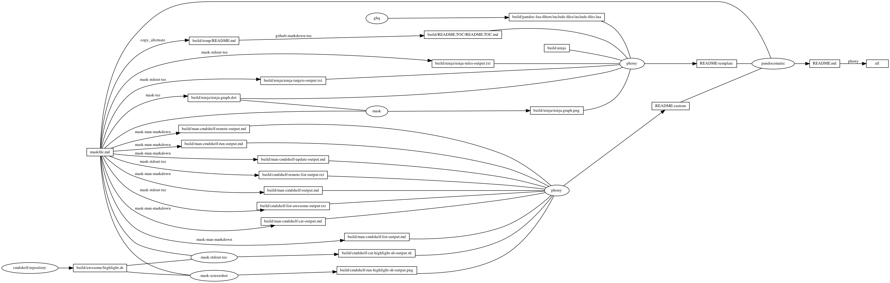

---
pandocomatic_:
    pandoc:
        from: markdown-smart
        to: gfm
        filter:
        - pandoc-include-code
        lua-filter:
        - ./build/pandoc-lua-filters/include-files/include-files.lua
        output: README.md
...

# cmdshelf

<!-- markdownlint-disable MD007 MD030 -->
```{.include}
./build/README.TOC/README.TOC.md
```
<!-- markdownlint-enable MD007 MD030 -->

# Mask SubCommands

[Mask Awesome](https://github.com/huzhenghui/mask-awesome)

## cmdshelf-remote-add

```bash
cmdshelf remote add awesome git@github.com:huzhenghui/cmdshelf-awesome.git
```

## cmdshelf-remote-list

```bash
cmdshelf remote list | ack '^awesome:'
```

### cmdshelf-remote-list-output

```{.plain include=./build/cmdshelf-remote-list-output.txt}
```

## cmdshelf-update

```bash
cmdshelf update
```

## cmdshelf-list-awesome

```bash
mask unlink-cmdshelf-repository
cmdshelf list | ack '^awesome:'
```

### cmdshelf-list-awesome-output

```{.plain include=./build/cmdshelf-list-awesome-output.txt}
```

## cmdshelf-cat-highlight-sh

```bash
cmdshelf cat highlight.sh
```

### cmdshelf-cat-highlight-sh-output

<!-- markdownlint-disable MD013 -->
```{.bash include=./build/cmdshelf-cat-highlight-sh-output.sh}
```
<!-- markdownlint-enable MD013 -->

## cmdshelf-run-highlight-sh

```bash
cmdshelf run highlight.sh "${MASKFILE_DIR}/maskfile.md"
```


## unlink-cmdshelf-repository

```bash
stub_path="${MASKFILE_DIR}/build/awesome"
echo "${stub_path}" 1>&2
if [[ -L "${stub_path}" ]]; then
    unlink "${stub_path}"
fi
```

## man-cmdshelf

```bash
man cmdshelf
```

### man-cmdshelf-output

<!-- markdownlint-disable MD012 MD013 -->
<!-- vale off -->
```{.include}
./build/man-cmdshelf-output.md
```
<!-- vale on -->
<!-- markdownlint-enable MD012 MD013 -->

## man-cmdshelf-cat

```bash
man cmdshelf-cat
```

### man-cmdshelf-cat-output

<!-- markdownlint-disable MD012 -->

```{.include}
./build/man-cmdshelf-cat-output.md
```
<!-- markdownlint-enable MD012 -->

## man-cmdshelf-list

```bash
man cmdshelf-list
```

### man-cmdshelf-list-output

<!-- markdownlint-disable MD012 -->

```{.include}
./build/man-cmdshelf-list-output.md
```
<!-- markdownlint-enable MD012 -->

## man-cmdshelf-remote

```bash
man cmdshelf-remote
```

### man-cmdshelf-remote-output

<!-- markdownlint-disable MD012 MD013 -->
<!-- vale off -->
```{.include}
./build/man-cmdshelf-remote-output.md
```
<!-- vale on -->
<!-- markdownlint-enable MD012 MD013 -->

## man-cmdshelf-run

```bash
man cmdshelf-run
```

### man-cmdshelf-run-output

<!-- markdownlint-disable MD012 MD013 -->
<!-- vale off -->
```{.include}
./build/man-cmdshelf-run-output.md
```
<!-- vale on -->
<!-- markdownlint-enable MD012 MD013 -->

## man-cmdshelf-update

```bash
man cmdshelf-update
```

### man-cmdshelf-update-output

<!-- markdownlint-disable MD012 -->
```{.include}
./build/man-cmdshelf-update-output.md
```
<!-- markdownlint-enable MD012 -->

## begin: mask task in template : build content

## ninja-rules

```bash
ninja -t rules
```

### ninja custom-rule

```{.ninja include=build.ninja snippet=custom-rule}
```

### ninja-rules-output

```{.plain include=./build/ninja/ninja-rules-output.txt}
```

## ninja-targets

```bash
ninja -t targets all
```

### ninja build-all

```{.ninja include=build.ninja snippet=build-all}
```

### ninja custom-build

```{.ninja include=build.ninja snippet=custom-build}

```

### ninja report-build

```{.ninja include=build.ninja snippet=report-build}

```

### ninja-targets-output

```{.plain include=./build/ninja/ninja-targets-output.txt}
```

## readme-md

```bash
ninja --verbose README.md
```

### ninja readme-build

```{.ninja include=build.ninja snippet=custom-readme-build}
```

```{.ninja include=build.ninja snippet=readme-build}
```

## end: mask task in template : build content

## begin: mask task in template : ninja command

## ninja-browse

```bash
ninja -t browse
```

## ninja-graph-png

```bash
dot -Tpng -o./build/ninja/ninja.graph.png ./build/ninja/ninja.graph.dot
```



## ninja-graph-dot-xdot

```bash
detach -- xdot "${MASKFILE_DIR}/build/ninja/ninja.graph.dot"
```

## ninja-graph-dot

```bash
ninja -t graph
```

### ninja-graph-dot-output

```{.dot include=./build/ninja/ninja.graph.dot}
```

## ninja-all

```bash
ninja --verbose
```

### build.ninja

```{.ninja include=./build.ninja}
```

## end: mask task in template : ninja command
